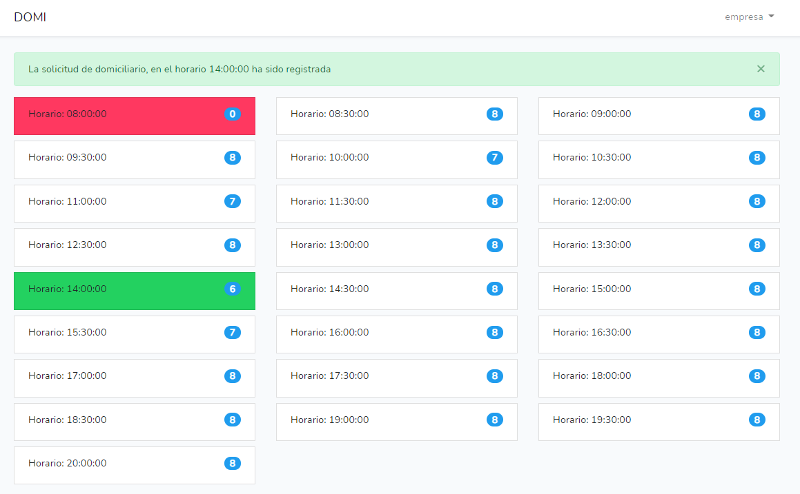

    DOMI

## Acerca de DOMI

DOMI es una prueba de desarrollo que se basa en la siguiente descripción:
>Construye una lista que contenga tramos horarios en intervalos de 30 minutos que empiece a las 8am y termine a las 8pm, la empresa tiene una disponibilidad de 8 motociclistas cada 30 minutos, cuando alguien haga clic sobre una de estas cajitas deberá tomar un recurso de motociclista, además de marcar la caja en verde, si el mismo usuario da clic sobre la caja deberá liberar el recurso, si otros usuarios han tomado a todos los motociclistas deberá aparecer en color rojo y no debe de dejar tomar ese horario

## Capturas

## Requerido y paquetes usados

- php: ^7.3|^8.0,
- fideloper/proxy: ^4.4,
- fruitcake/laravel-cors: ^2.0,
- guzzlehttp/guzzle: ^7.0.1,
- laravel/framework: ^8.12,
- laravel/tinker: ^2.5,
- laravel/ui: ^3.2,
- laraveles/spanish: ^1.5,
- livewire/livewire: ^2.3

### Instrucciones de implementacion

1. Clonar el repositorio o descargar ***git clone https://github.com/amendozaaguiar/domi.git***.
2. Ejecutar las migraciones ***php artisan migrate***.
3. Ejecutar los seeder  ***php artisan db:seed***.
